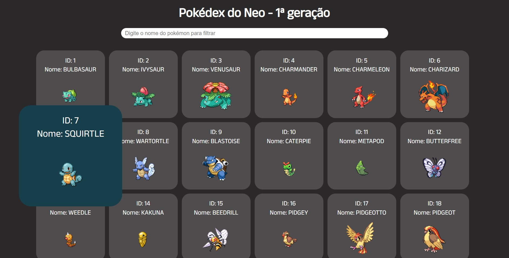

# Pokédex da primeira geração em REACT JS

## A pokédex foi desenvolvida utilizando reactjs, styled components e axios. 

- Se alimenta da api https://pokeapi.co/api/v2/pokemon para trazer os dados de cada pokémon da primeira geração
- Renderiza na tela todos os pokémon mostrando o id, nome e sprite. 
- Possui um input para filtragem dos pokémon por nome.

## Instalação
- clonar o repositório

- npm install

- npm run dev
